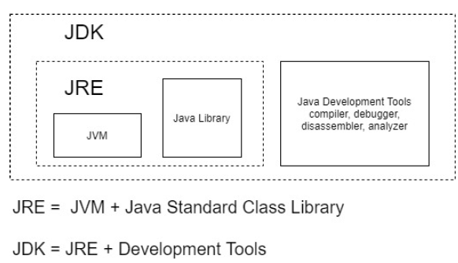

## 1.1. Understanding Java
Java is a Collection of many aspects (Separated from each other):

- **Programming Language:**  Java is a programming language with its own syntax, similar to other languages.
- **Java Development Kit (JDK):**  The JDK contains all the tools needed to run Java programs, including the compiler and disassembler, which translate high-level Java code into machine-readable format.
- **Java Virtual Machine (JVM):**  The JVM is a software-based simulation of a computer. It abstracts the underlying hardware, allowing Java bytecode to be executed on any device regardless of its architecture. Each OS has its own JVM version that further converts bytecode into the specific machine language of that system.
- **Java Bytecode:**  Java code is compiled into bytecode, an intermediate, platform-independent code that the JVM understands and translates into native machine language during execution.
- **Java Class Library (APIs):**  Java programs are modularized into multiple files for better management and code reuse. These modules, grouped as libraries and organized in packages, are known as Java APIs.
- **Java Runtime Environment (JRE):**  The JRE combines the JVM and Java APIs into one package, making the “Write Once, Run Anywhere” concept possible. This means that Java programs can run on any device that has a JRE without needing multiple versions.
- **Modularity of Java Aspects:**  Java’s different aspects (language, JDK, JVM, libraries) are independent. For instance, Android Studio uses Java as a programming language, but it compiles the code using its own tools, not a standard JVM or JRE.

*Note:* Like any other software, JVM also need to go through the OS to get the computer resources needed to mimic a same version of a physical computer

## 1.2. Java Features

#### From a Management Perspective
- Platform Independent: Java programs can run on any device with a compatible JVM.
=> Because the JVM abstracts the underlying hardware, the same Java application can be executed on different operating systems without modification. This reduces development and testing costs, and simplifies maintenance when deploying across diverse environments.

- High Performance: Java’s performance has significantly improved over time.
=> Early versions of Java were slower compared to C/C++, but advancements in JVM technology (such as Just-In-Time (JIT) compilation) have optimized execution speed. This makes Java competitive even for performance-sensitive applications.

- Secure: Java has built-in security features that limit access to system resources.
=> The Java Security Manager restricts what a Java program can do, reducing the risk of malicious actions by sandboxing the code. This built-in security helps prevent unauthorized access to the underlying hardware and operating system.

- Familiar: Java’s syntax is similar to C/C++.
=> Developers with a background in C or C++ can quickly adapt to Java, leading to faster onboarding and productivity. This familiarity speeds up development cycles and reduces training costs.

- Simpler: Java removes many complex features of C/C++ (e.g., pointer arithmetic, operator overloading).
=> By eliminating error-prone features, Java reduces the likelihood of bugs and makes programs easier to debug. This simplicity results in more robust code and a lower maintenance burden.

- Multiple Delivery Modes and Deployment Options: Java applications can be delivered in various ways (e.g., via Java Web Start, applets).
=> Flexible deployment options allow applications to be distributed over networks, run as standalone programs, or embedded in web pages, providing versatility in how software is delivered to end users.

- Java Ecosystem: A large community supports Java with a vast range of open-source libraries and frameworks.
=> The availability of libraries for tasks such as PDF handling, encryption, and email processing accelerates development. Developers can leverage existing solutions rather than building from scratch, reducing both time-to-market and development costs.

- Backward Compatibility: New versions of Java maintain compatibility with older code.
=> This means that applications built on older Java versions continue to work on newer JVMs without major modifications, ensuring long-term stability and reducing the cost and risk associated with upgrades.

#### From a Technology Perspective
- Compiled: Java code is compiled into bytecode before execution.
=> The compilation into bytecode makes runtime interpretation faster because the JVM converts this intermediate code into machine language efficiently. In contrast, languages that are interpreted directly (like JavaScript or PHP) can suffer from slower execution times.

- Variety of Technological Solutions Under One Umbrella: Java supports various technologies for different needs (e.g., GUI with Java Swing).
=> Whether you need to build desktop applications, web applications, or mobile apps, Java offers specialized libraries and frameworks that simplify development for each domain.

- Multithreaded: Java has robust support for multithreading.
=> This allows developers to write programs that perform multiple tasks concurrently, improving application performance on multi-core processors and providing better responsiveness for user interactions.

- Distributed: Java facilitates the development of distributed applications.
=> With features that support remote communication and resource sharing, Java can easily handle scenarios where the client handles the user interface and the server manages data processing. This separation enhances scalability and performance in networked applications.

- Garbage Collection: Java automatically manages memory through garbage collection.
=> Developers do not need to manually deallocate memory, reducing the risk of memory leaks and other errors. The JVM automatically cleans up objects that are no longer in use, which simplifies programming and leads to more stable applications.

#### From a Programming Perspective
- Object-Oriented: Java is fundamentally object-oriented.
=> This encourages the use of encapsulation, inheritance, and polymorphism, making code more modular, easier to manage, and simpler to extend or modify.

- Structured: Java promotes structured programming by breaking down large programs into smaller, manageable pieces.
=> This separation into classes and methods makes the code more readable, maintainable, and reusable. Java even supports elements of procedural and functional programming (e.g., lambda expressions), offering flexibility in coding paradigms.

- Statically Typed: Variable types are determined at compile time.
=> This ensures type safety and catches many errors during compilation rather than at runtime. It leads to more reliable code and easier debugging since type-related issues are detected early.

- Strongly Typed: Once a variable’s type is declared, it cannot be changed.
=> This strict type enforcement prevents inadvertent type mismatches and runtime errors, leading to more robust and predictable code behavior.

- Automatic Memory Management: Developers are relieved from manual memory allocation and deallocation.
=> The JVM’s automatic memory management, via garbage collection, helps prevent memory-related bugs and simplifies coding by handling object lifecycle management automatically.

- Programmatic Exception Handling: Java has a built-in mechanism for handling errors through try-catch blocks.
=> This allows developers to manage exceptions gracefully, ensuring that unexpected events can be caught and managed without crashing the program, thereby enhancing application reliability.

- Ready-Made Class Library: Java provides an extensive set of APIs covering many common tasks.
=> From file I/O and networking to encryption and data structures, the extensive library support accelerates development. Developers can use these pre-built classes and methods to handle common tasks efficiently, reducing development time and potential errors.

## 1.3. Structure of Java Programs
#### Zero or One Package Statement:
- The package statement, if present, defines the namespace for the classes in the file. It groups related classes and interfaces together and helps avoid naming conflicts.
- Organizing classes into packages improves code maintainability, readability, and modularity. It also helps in managing large codebases by logically grouping similar functionalities.
#### Zero or More Import Statements:
- Import statements allow the program to use classes and interfaces that are defined in other packages.
- Instead of fully qualifying every class name, imports simplify code by letting you reference classes directly. This makes your code cleaner and more readable, and promotes reusability of standard or third-party libraries.
#### One or More “Type” Definitions:
- “Type” definitions refer to the declarations of classes, interfaces, enums, or annotations. Essentially, these define the building blocks of your program.
- A Java program must have at least one type definition, as it is the container for the logic and data. These types encapsulate functionality and define the structure of the program. They enable object-oriented design by encapsulating data and behavior into reusable components.

## 1.4. Conventions 
#### Cases:
- Class Names: Must start with an uppercase letter (e.g., ReadOnlyArrayList).
- Package Names: Should be in lowercase (e.g., datastructure).
- Variable Names: Begin with a lowercase letter. Although underscores can be used (e.g., current_account), the camelCase style (currentAccount) is preferred.

#### Naming:
- Meaningful Variable Names: Use descriptive names that reflect the variable's purpose and type, avoiding non-descriptive names like “foo” or “bar.”
- Static Typing: Since Java is statically typed and variable types cannot change once declared, meaningful naming helps clarify the variable’s role.

#### Package Naming:
- Uniqueness: Package names must be unique.
- Convention: Typically follow a reversed domain name format combined with division/department/application names (e.g., com.fpt.autodivi.aiprog), ensuring that package names remain globally unique.

## 1.5. Package

| Package             | Brief description                                                                                                  | Commonly used classes                                                       |
| ------------------- | ------------------------------------------------------------------------------------------------------------------ | --------------------------------------------------------------------------- |
| java.lang           | Provides classes that are critical for the functioning of any Java program                                         | Object, Math, System, Runtime, Exception, RuntimeException, wrapper classes |
| java.util           | Provides tools and utility classes for creating commonly used data structures, internationalization, date handling | Collection, List, ArrayList, Set, Map, Date, Locale                         |
| java.io             | Provides classes for performing input and output (I/O) activities involving files and other I/O devices            | InputStream, OutputStream, FileReader, FileWriter, IOException              |
| java.sql            | Provides classes for dealing with relational databases                                                             | DriverManager, Connection, Statement, ResultSet                             |
| java.net            | Provides classes for performing network communication                                                              | Socket, ServerSocket                                                        |
| java.awt/java.swing | Provides classes for building Graphical User Interfaces (GUI)                                                      | Frame, Dialog, Button, ActionEvent, LayoutManager                           |

